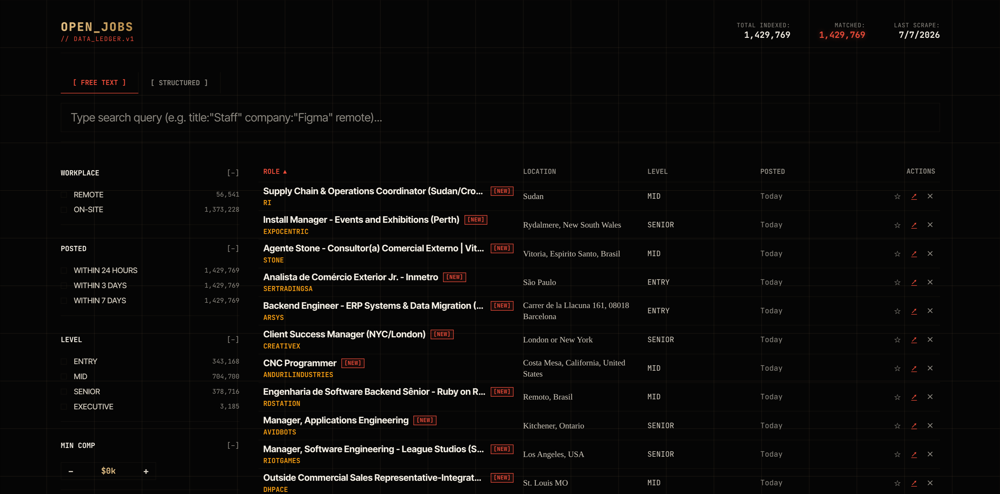

<div align="center">
  
  
# Open Jobs Data Ledger
  
  A completely serverless, high-performance job aggregator and UI. Scrape, deduplicate, and serve millions of job postings directly from GitHub Pages with a near-zero latency Web Worker-powered frontend.
</div>

## 🚀 Overview

This project provides a fully automated pipeline to aggregate job postings across **50+ ATS platforms**. It runs entirely on GitHub Actions, deduplicates the data, and publishes it as a static site on GitHub Pages. The UI leverages Web Workers and indexed chunks to handle millions of records without locking up the browser.

### Key Features

- **Zero Backend Required:** Fully automated via GitHub Actions and hosted on GitHub Pages.
- **Blazing Fast UI:** Custom Web Worker implementation processes filtering and pagination over 1.5M+ records in milliseconds.
- **Smart Data Synchronization:** Runs a full heavy-scrape every 3 days, but performs daily lightweight cache syncs to stay up-to-date without hitting rate limits.
- **Multi-Engine Scraper:** Combines a high-concurrency TypeScript/Bun scraper with a fallback Python scraper for maximum coverage.

## 🛠️ Tech Stack

- **Frontend:** Vanilla HTML/CSS/JS with Web Workers for heavy data crunching.
- **Primary Scraper:** TypeScript running on **Bun** (for extreme speed and concurrency).
- **Secondary Scraper:** Python 3.11 with `requests` and `ThreadPoolExecutor`.
- **CI/CD & Hosting:** GitHub Actions & GitHub Pages.

## 📊 Supported ATS Boards (57 Total)

The scraping engine supports extracting structured data from the following platforms:

| TypeScript / Bun Scraper (50 Boards)                                                                                                                                                                                                                                                                                                                                                                                                                                                                                                                                | Python Scraper (7 Boards)                                     |
| :------------------------------------------------------------------------------------------------------------------------------------------------------------------------------------------------------------------------------------------------------------------------------------------------------------------------------------------------------------------------------------------------------------------------------------------------------------------------------------------------------------------------------------------------------------------ | :------------------------------------------------------------ |
| Greenhouse, Lever, Ashby, BambooHR, Workday, Recruitee, Breezy, Personio, Workable, SmartRecruiters, CSOD, Taleo, UltiPro, Jobvite, ZohoRecruit, TalentLyft, PinpointHQ, ApplicantPro, ApplicantStack, Homerun, Factorial, Eightfold, SuccessFactors, AmazonJobs, AppleJobs, TikTokCareers, MetaCareers, JSON-LD, Brassring, GJobsFeed, OracleCloud, Phenom, HRMDirect, SchoolSpring, iSolvedHire, Applitrack, HiringThing, Apploi, Hirebridge, TaleoTBE, Workstream, CareerPlug, JibeApply, Hireology, ApplicantPool, PageUp, Manatal, Rippling, iCIMS, Teamtailor | Greenhouse, Lever, Ashby, BambooHR, Workday, iCIMS, Paylocity |

## 💻 Running Locally

### 1. TypeScript Scraper (Bun)

Ensure you have [Bun](https://bun.sh/) installed (\`curl -fsSL <https://bun.sh/install> | bash\`).

```bash
cd ts_scraper
bun install
bun run scrape --input data/scrape-inputs/example.json --output data/scrape-outputs/example.json
```

### 2. Python Scraper

Ensure you have Python 3.11+ installed.

```bash
cd py_scraper
pip install -r requirements.txt
python scripts/scraper.py --source automated
```

### 3. Local UI Testing

To test the web interface locally, you need a local server (to avoid CORS issues with Web Workers).

```bash
cd ui
python -m http.server 8000
# Then open http://localhost:8000 in your browser
```

## ☁️ Deploying to GitHub Pages

1. **Fork or Clone** this repository to your GitHub account.
2. Go to your repository **Settings** > **Pages**.
3. Under **Build and deployment**, set the **Source** to **GitHub Actions**.
4. The `.github/workflows/scrape-build-deploy-push.yml` workflow will automatically trigger when you push to the `master` branch.
5. The workflow will run the smart cache checks, deduplicate the data, generate the UI chunks, and publish directly to your GitHub Pages URL!
